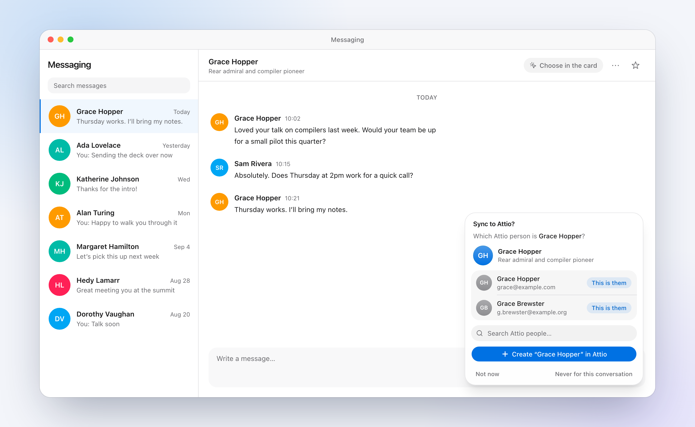
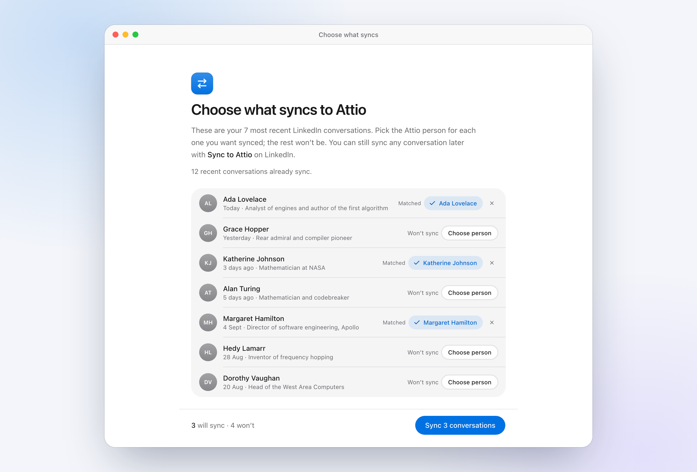
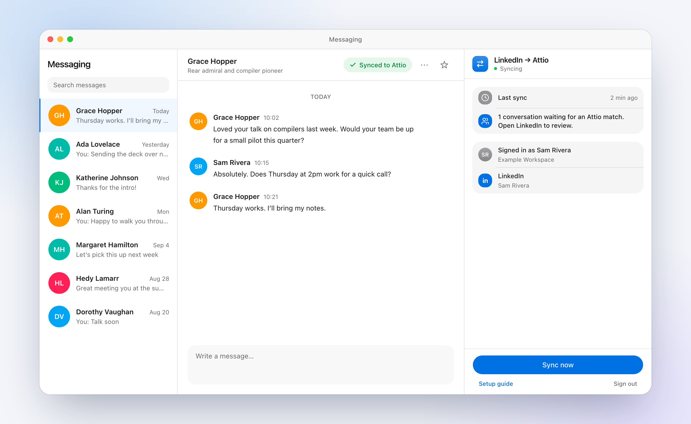

# LinkedIn → Attio Sync

Keeps your team's LinkedIn conversations on the right people in Attio. Each teammate installs a Chrome extension and signs in with Attio. When they reply to someone on LinkedIn, a card asks which Attio person it is, and the conversation becomes a note on that person that stays up to date. Any thread can also be pulled in with a **Sync to Attio** button.

It's built to be forked: deploy your own copy on Vercel, Supabase and your Attio workspace, then send your team the install page.

This repository is a snapshot shared for forking. It isn't maintained, and issues and pull requests won't be answered; make your fork your own.



> **Heads-up:** there's no official LinkedIn messaging API. The extension reads each user's own inbox through LinkedIn's internal web API, using their signed-in browser session. That may conflict with LinkedIn's terms of service. Decide whether that's acceptable for your organization before rolling it out.

## What it looks like

After signing in, each teammate chooses which of their 100 most recent LinkedIn conversations sync. Attio people with the same LinkedIn URL are preselected; the rest get suggestions, search or "create in Attio".



The toolbar button opens a side panel with sync status, next to whatever tab is open.



The screenshots use sample data. Regenerate them with `node apps/web/scripts/capture-screenshots.mjs` while `pnpm --filter web dev` runs.

## How it works

```
apps/extension   Chrome MV3 extension. Holds the LinkedIn session, runs the requests the backend asks for,
                 shows the Attio card and the Sync to Attio button on linkedin.com.
apps/web         Next.js backend on Vercel. Parses LinkedIn responses, stores state in Supabase, writes Attio
                 notes, runs "Sign in with Attio", and serves /install and /privacy.
packages/core    Shared protocol types, LinkedIn request config and parsers, Attio client and note renderer.
```

The extension stays deliberately thin: request definitions and parsing live on the backend, so most LinkedIn changes are fixed with a deploy. An optional self-healing loop detects those changes and has a Claude Code routine open a fix PR ([docs/SELF_HEALING.md](docs/SELF_HEALING.md)).

## Deploy your own

You need a GitHub fork, a Vercel account, a Supabase project and admin access to an Attio workspace. Locally: Node 24 and pnpm 10.

1. **Fork and install.**
   ```bash
   git clone https://github.com/<owner>/<repo>.git && cd <repo>
   pnpm install
   ```
2. **Database.** Create a Supabase project, then apply the schema:
   ```bash
   cd apps/web
   supabase link --project-ref <your-project-ref>
   supabase db push
   ```
3. **Attio access token.** In Attio, go to Workspace settings → Developers and create an access token with `record_permission:read-write`, `object_configuration:read` and `note:read-write`. The backend uses it to search people and write notes.
4. **Vercel project.** Import the fork, set **Root Directory** to `apps/web`, and deploy once to get its domain. Functions run in `dub1` (Dublin) by default. Change `apps/web/vercel.json` to the region closest to your Supabase project.
5. **Attio OAuth app** for sign-in. Follow [docs/TEAM_SETUP.md](docs/TEAM_SETUP.md#for-the-admin-once). The redirect URI is `https://<your-backend>/api/auth/attio/callback`.
6. **Environment variables.** Add these in Vercel, then redeploy:

   | Variable | Required | Value |
   |---|---|---|
   | `SUPABASE_URL` | yes | Your Supabase project URL |
   | `SUPABASE_SERVICE_ROLE_KEY` | yes | The project's service role key (server-side only) |
   | `ATTIO_API_TOKEN` | yes | The access token from step 3 |
   | `ATTIO_OAUTH_CLIENT_ID` | yes | From the Attio OAuth app |
   | `ATTIO_OAUTH_CLIENT_SECRET` | yes | From the Attio OAuth app |
   | `AUTH_SECRET` | yes | Random secret that signs sign-in state: `openssl rand -base64 48` |
   | `PUBLIC_BASE_URL` | on a custom domain | The URL the backend is served from. On Vercel it defaults to the production domain. It must match the Attio redirect URI. |
   | `CLAUDE_ROUTINE_FIRE_URL`, `CLAUDE_ROUTINE_TOKEN` | no | Enable self-healing ([docs/SELF_HEALING.md](docs/SELF_HEALING.md)) |

   Sign-in only admits members of the workspace that `ATTIO_API_TOKEN` belongs to.
7. **Try it, then invite the team.** Open `https://<your-backend>/install`, install the extension and sign in. Then share that link. Teammate steps are in [docs/TEAM_SETUP.md](docs/TEAM_SETUP.md#for-teammates).

Review `/privacy` (`apps/web/src/app/privacy/page.tsx`) and adjust it to your organization's practices before sharing it.

## Releasing an extension update

1. Bump the version in `apps/extension/package.json` and `LATEST_EXTENSION_VERSION` in `packages/core/src/version.ts`.
2. Merge to `main`. The Vercel build packages the extension against the deployment's own URL and serves it from `/install`.
3. Teammates see an "Update available" banner in the extension's side panel. They download the new build, replace their folder, reload the extension and refresh LinkedIn tabs.

## Development

```bash
pnpm --filter @linkedin-sync/core test       # parsers, scrubbing, note rendering
pnpm --filter web dev                        # backend on http://localhost:3000 (needs apps/web/.env.local)
pnpm --filter extension build                # extension targeting localhost, in apps/extension/dist/chrome-mv3
```

For local sign-in, set `PUBLIC_BASE_URL=http://localhost:3000` in `apps/web/.env.local` and add `http://localhost:3000/api/auth/attio/callback` as a redirect URI on a development Attio app. More in [apps/extension/README.md](apps/extension/README.md).

## License

[MIT](LICENSE)
